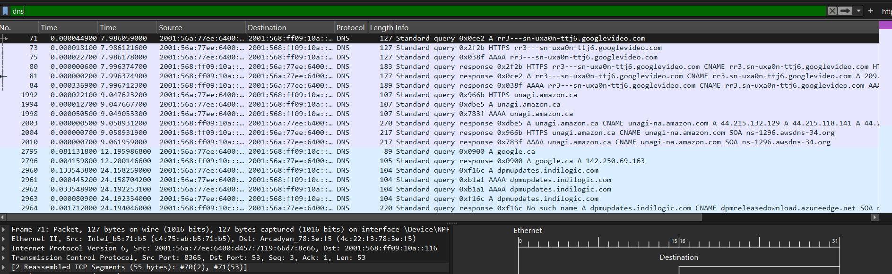
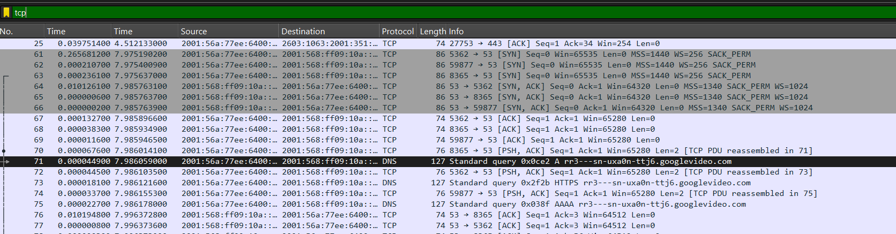
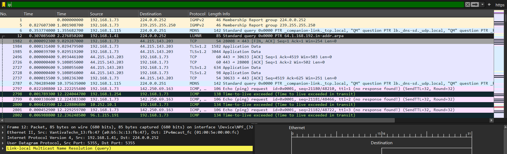

# Network Baseline Analysis (Wireshark)

## Objective
To understand normal network behavior on a personal device by capturing and analyzing traffic using Wireshark.

## Tools Used
- Wireshark

## Methodology
1. Captured live network traffic for 2–3 minutes
2. Browsed common websites (Google, YouTube, Amazon)
3. Filtered traffic using DNS, TCP, and IP filters
4. Analyzed patterns of communication

## Key Observations
- DNS queries show websites being resolved to IP addresses
- TCP connections are established before secure communication begins
- Multiple background connections to Google/Microsoft services observed
- HTTPS traffic is encrypted (content not visible)

## DNS Traffic

- Standard query
- Standard query response
- Browsed Google / YouTube / Amazon
- System is making background service calls
- DNS resolves both A and AAAA records (IPv4 + IPv6)
- No suspicious or unknown malicious domains visible

## TCP Connections

- TCP handshake (SYN/SYN-ACK/ACK)
- DNS Standard query -- Device is asking: “What is the IP of this YouTube/Google video server?”
- PSH, ACK --content becomes unreadable (HTTPS encryption)
- TCP PDU reassembled --This data was split into multiple packets, wireshark stitched it back together

## IP

  
## Conclusion
The system exhibits normal baseline behavior with expected DNS resolution, TCP connections, and encrypted HTTPS traffic.
This baseline can be used for future anomaly detection.
